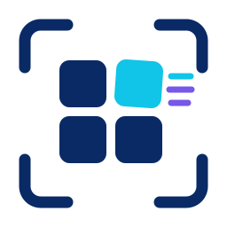

<div align="center">
  
  <h1>Viset</h1>
  <p><strong>Write browser screenshots and animations as code for testing and demoing your web apps.</strong></p>
  <p>
    <a href="https://github.com/getviset/Viset/actions/workflows/nix.yml"></a>
    <a href="https://github.com/getviset/Viset/actions/workflows/portability.yml"></a>
  </p>
  <p>
    <a href="https://github.com/getviset/Viset/wiki">Documentation</a>
    &nbsp;&middot;&nbsp;
    <a href="examples">Examples</a>
    &nbsp;&middot;&nbsp;
    <a href="benchmarks">Benchmarks</a>
    &nbsp;&middot;&nbsp;
    <a href="CONTRIBUTING.md">Contributing</a>
  </p>
</div>

## Quick start

With [Nix](https://nixos.org/) installed:

```sh
nix run github:getviset/Viset -- init demo
nix run github:getviset/Viset -- capture demo/capture.lua
```

Open `demo/output/example.png`. That is a complete, self-contained first
capture; edit `demo/capture.lua` to point it at your page.

## One file, every capture

The capture file keeps its configuration and browser actions together:

```lua
--[[
# viset
version = 1
output = "output/{device}-{theme}.png"

[devices.desktop.viewport]
width = 1280
height = 720

[matrix]
theme = ["light", "dark"]
]]

viset.page.navigate("https://example.com")
viset.snapshot()
```

Viset expands the matrix and writes both outputs. The same model supports
multiple devices, framed captures, and continuous animated WebP recording.

## Built for reproducible capture

- **Single-file intent.** The strict TOML header and trusted Lua actions live in
  execution order.
- **Matrix-native output.** Declare devices and axes once; Viset expands them
  deterministically.
- **Screenshots and motion.** Capture PNG stills or pauseable animated WebPs.
- **Direct ownership.** Outputs are ordinary files ready for Git, docs, tests,
  or publishing.

## Explore Viset

| | |
| --- | --- |
| **[Read the wiki](https://github.com/getviset/Viset/wiki)** | Install Viset and learn the capture format and Lua API. |
| **[Try the examples](examples)** | Start small, then explore device and theme matrices. |
| **[Review the benchmarks](benchmarks)** | See measured capture, encoder, pipeline, and decoder results. |
| **[Use viset.nvim](https://github.com/getviset/viset.nvim)** | Add Neovim highlighting for Viset capture files. |
| **[Contribute](CONTRIBUTING.md)** | Build, test, format, and propose changes. |

## Status

Viset is pre-release software. The Nix flake is the supported public route
today; release archives and package-manager channels will follow once they are
verified.

Capture files are trusted local programs and are not sandboxed. Read a capture
before running it.

Viset is available under the [MIT License](LICENSE).
