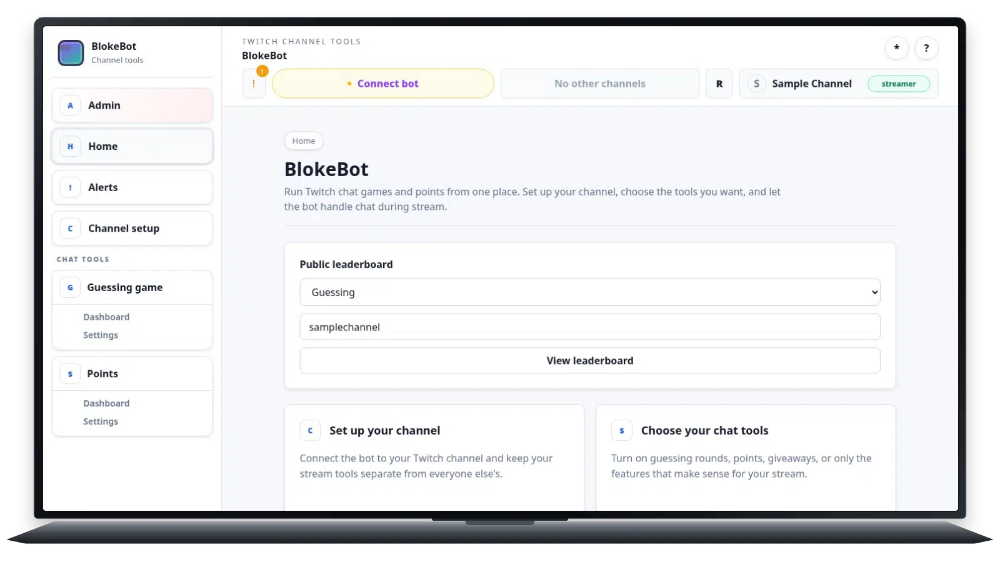

# JPEG improves controlled acquisition but not scrolling capture

## Summary

JPEG q95 source with `libwebp_full`, spooled, lossy q75, method 0. JPEG is
selectable but remains non-default because the duplicate-heavy end-to-end run
regressed.

## Example

[Capture fixture](capture-1600x900.lua) · [Raw log](capture-1600x900.log)

## Results

| Logical frames | Encoded frames | Acquisition p95 | Production/frame | Decode p95 | Encode p95 | Size |
| ---: | ---: | ---: | ---: | ---: | ---: | ---: |
| 90 | 43 | 35.69 ms | 12.74 ms | 25.36 ms | 78.38 ms | 2.8 MB |
