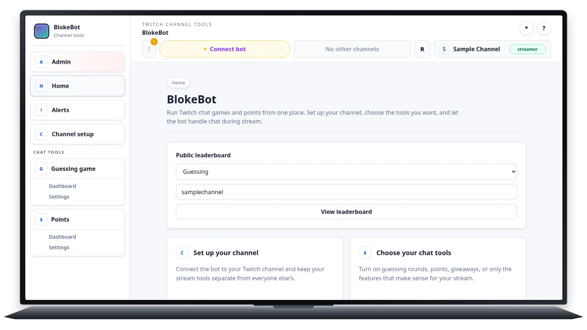

# Live is slightly faster but remains non-default

## Summary

PNG source with `libwebp_full`, live, lossy q75, method 0. Live prepares frames
during capture, keeps eight pending compressed frames in memory, and spills
overflow to disk. Promotion still requires human visual approval.

## Example

[Capture fixture](capture-1600x900.lua) · [Raw log](capture-1600x900.log)

## Results

| Logical frames | Encoded frames | Acquisition p95 | Production/frame | Decode p95 | Encode p95 | Size |
| ---: | ---: | ---: | ---: | ---: | ---: | ---: |
| 90 | 43 | 26.52 ms | 12.83 ms | 21.28 ms | 86.91 ms | 2.8 MB |

This run spilled **24 frames** to temporary disk.
