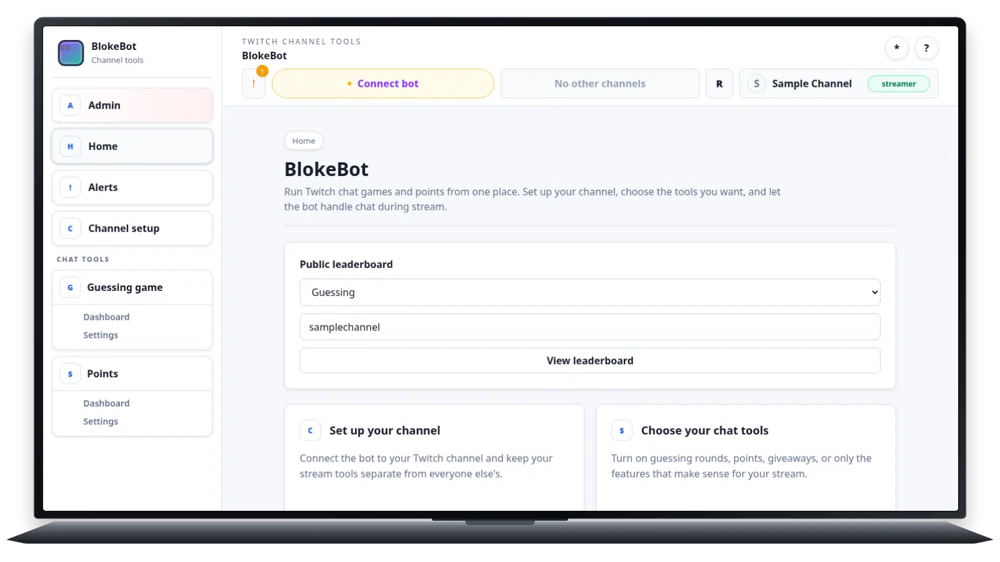

# PNG screencast remains the default source

## Summary

PNG source with `libwebp_full`, spooled, lossy q75, method 0. PNG remains the
default because JPEG did not improve the duplicate-heavy capture and lacks
human visual approval.

## Example

[Capture fixture](capture-1600x900.lua) · [Raw log](capture-1600x900.log)

## Results

| Logical frames | Encoded frames | Acquisition p95 | Production/frame | Decode p95 | Encode p95 | Size |
| ---: | ---: | ---: | ---: | ---: | ---: | ---: |
| 90 | 42 | 32.77 ms | 12.05 ms | 19.35 ms | 79.74 ms | 2.8 MB |
