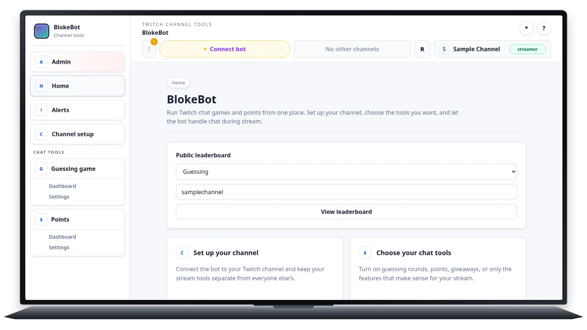

# Spooled remains the default pipeline

## Summary

PNG source with `libwebp_full`, spooled, lossy q75, method 0. Compressed frames
are written to temporary disk and prepared after capture. This remains the
pipeline default.

## Example

[Capture fixture](capture-1600x900.lua) · [Raw log](capture-1600x900.log)

## Results

| Logical frames | Encoded frames | Acquisition p95 | Production/frame | Decode p95 | Encode p95 | Size |
| ---: | ---: | ---: | ---: | ---: | ---: | ---: |
| 89 | 43 | 30.19 ms | 13.15 ms | 21.66 ms | 86.20 ms | 2.9 MB |
